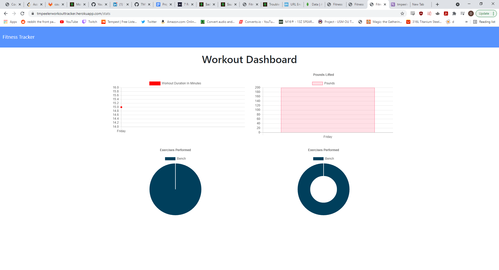

# workout-tracker
The purpose of this assignment was to add server side code that defined models and routes for an already existing client side application.

## Getting Started
I began this assignment by generating a new repo and adding over the start code given in a develop folder. I then took the contents out of the folder and began writing routes. I needed to make routes for my different HTML pages and serving those respective HTMl pages based on the route. I also needed another route file for my API routes and making requests

### Prerequisites
Installation of the proper dependencies is required. Those dependencies include express, mongoose, and morgan. After that it was required to seed the database.

### Solving
Writing the routes for the HTML was rather simple because it only required sending files based on the routes of their respective pages. The API routes only required making PUT, POST, and GET requests. One of those routes was posting to create a new workout based on the request body. Another was a put route for getting workouts and updating them by ID which was useful for adding another exercise to an existing workout. Then I only needed to make a get request to return all the workouts with an aggregate function that allowed the adding of total exercise time.

## Technologies Used

* [JavaScript](https://www.javascript.com/)
* [ExpressJS](https://expressjs.com/)
* [NodeJS](https://nodejs.org/en/)
* [MongoDB](https://www.mongodb.com/)
* [Mongoose](https://mongoosejs.com/docs/)

## Screenshot 

;

## Authors
* **Thomas Peeler** 

## Deployed Link

- [https://tmpeelerworkouttracker.herokuapp.com/]

## Github Repository
- [https://github.com/TMPeeler/workout-tracker]